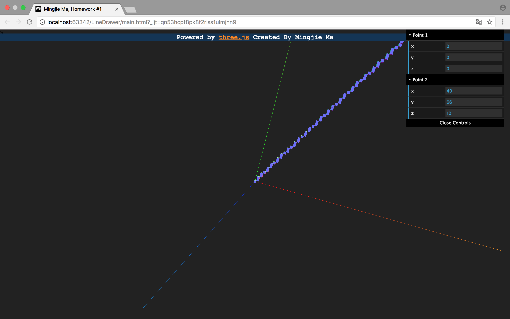

# 3D Line Renderer Based on Bresenham Algorithm Using Three.js

**Author**: Mingjie MA

**Student No**:1452735

**Tutored By**: Jinyuan Jia


## Background

This is to complete the first assignment of Computer Graphics course of Software Engineering School of Tongji Univeristy in 2018 Spring. The assignment asks for an implementation of a line drawer based on the integer incremental algorithms taught in class extended to 3D scope.

Among the 3 methods discussed in class, Bresenham algorithm is the most efficient, which this implementation chooses as the underlying idea. The idea extended to 3D case is the same except for an additional dimension. Other implementations exist on the web, this implementation quoting one of them (See References)


##Overview

###Functionality

*The 3D Line Renderer Based on Bresenham Algorithm Using Three.js*, hereinafter referrer to as the **line renderer**, depicts a line strip connecting two points (specified with 2 set of 3 coordinates, in total 6 float number inputs) in a right-hand system, its axes also shown, on a canvas element in a Hypertext file. 

### Dependencies

Technically speaking. None. All used packages are included in the `js`  folder, among them ```three.js```  the WebGL framework, ```TrackballControls.js``` the FOV control, and ```dat.gui.js``` user input handler.

Modern browsers including Firefox, Chrome, Safari etc. will all be able to render it, as long as WebGL support is available.

### Project Struture

```reStructuredText
js/						#contains all javascript files
	control.js 			#library for mouse and trackball control
	data.gui.js			#library for minimal user input control
	main.js				#renderer script
	three.js			#three.js library
index.html				#hypertext file, provides canvas
README.md				#this document
```

### Details
| Methods/Global Variables | Description |
| ---- | ---- |
|   animate()   | render a frame |
| draw_line(point_1, point_2) | returns a THREE.group object contains cube meshes representing the line connecting two points |
| init() | initialize the app |
| init_camera() | initialize the camera |
| init_controls() | initialize the mouse and trackball controls |
| init_gui() | initialize the user input widget |
| init_light() | initialize the light |
| init_miscellaneous() | initialize axes display and register event listener |
| init_renderer() | initialize the renderer |
|init_scene()|initialize the scene|
|onload|window onload callback|
|onWindowResize()|window resize callback|
|Point(x, y, z)|3D point constructor|

## Algorithm

Rasterization algorithm: Bresenham family.

Bresenham's line algorithm is an algorithm that determines the points of an n-dimensional raster that should be selected in order to form a close approximation to a straight line between two points, commonly used to draw line primitives.

In 2D case, the algorithm can be interpreted as follows. When a pixel is decided, the next pixel is to be selected from the one next to its right or upper right, (supposing as x increments, y increments as well but no more than x, other cases can be handled by exchanging direction or coordinates.) The algorithm calculates whether it is above or below the midpoint of neighboring pixels, when it goes through the next vertical line. Detailed to be found in course materials. 

In 3D case, the algorithm is the same in choosing voxels along both directions. It can be summarized in the following pseudocode.

```
	point[0] = x1;
    point[1] = y1;
    point[2] = z1;
    dx = x2 - x1;
    dy = y2 - y1;
    dz = z2 - z1;
    x_inc = (dx < 0) ? -1 : 1;
    l = abs(dx);
    y_inc = (dy < 0) ? -1 : 1;
    m = abs(dy);
    z_inc = (dz < 0) ? -1 : 1;
    n = abs(dz);
    dx2 = l << 1;
    dy2 = m << 1;
    dz2 = n << 1;
    
    if ((l >= m) && (l >= n)) {
        err_1 = dy2 - l;
        err_2 = dz2 - l;
        for (i = 0; i < l; i++) {
            draw_pixel(point[0], point[1], point[2]);
            if (err_1 > 0) {
                point[1] += y_inc;
                err_1 -= dx2;
            }
            if (err_2 > 0) {
                point[2] += z_inc;
                err_2 -= dx2;
            }
            err_1 += dy2;
            err_2 += dz2;
            point[0] += x_inc;
        }
    } else if ((m >= l) && (m >= n)) {
        err_1 = dx2 - m;
        err_2 = dz2 - m;
        for (i = 0; i < m; i++) {
            draw_pixel(point[0], point[1], point[2]);
            if (err_1 > 0) {
                point[0] += x_inc;
                err_1 -= dy2;
            }
            if (err_2 > 0) {
                point[2] += z_inc;
                err_2 -= dy2;
            }
            err_1 += dx2;
            err_2 += dz2;
            point[1] += y_inc;
        }
    } else {
        err_1 = dy2 - n;
        err_2 = dx2 - n;
        for (i = 0; i < n; i++) {
        	draw_pixel(point[0], point[1], point[2]);
            if (err_1 > 0) {
                point[1] += y_inc;
                err_1 -= dz2;
            }
            if (err_2 > 0) {
                point[0] += x_inc;
                err_2 -= dz2;
            }
            err_1 += dy2;
            err_2 += dx2;
            point[2] += z_inc;
        }
    }
    draw_pixel(point[0], point[1], point[2]);
}
```


## Analysis

### Implementation

Voxels, short for volume pixels, are the basic elements of 3D rendering. Resembling a pixel, they are also units of rasterization. The renderer uses a cube of unit length, width and height to represent a voxel in space. Specifically, in ```three.js```, this means to create a ```Mesh``` object with a ```CubeGeometry``` and ```MeshNormalMaterial```, whenever a voxel is required. 

```javascript
var geometry = new THREE.BoxBufferGeometry(1, 1, 1);
var material = new THREE.MeshNormalMaterial();
var mesh = new THREE.Mesh(geometry, material);
group.add(mesh)
```

In this snippet, group is the line that we are drawing, and the mesh is a voxel added into this line.

### Performance

This implementation uses only integer addition, subtraction and bit shifting, and thus minimizes the computation time.

The result can be seen in the following picture




## References

[1]:
https://en.wikipedia.org/wiki/Bresenham%27s_line_algorithm#Similar_algorithms "Wikipedia: Bresenham Algorithm"

[2]:
https://gist.github.com/yamamushi/5823518 "Github: Bresenham algorithm implementation written in C++"

